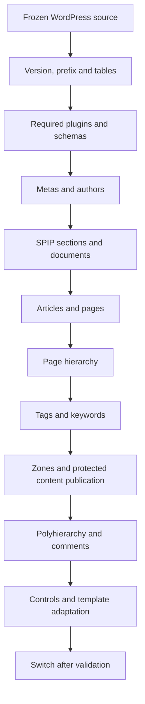

# The migration chain

The SPIP-Cli command orchestrates a sequence of dependent processes. It reads the WordPress version, determines the prefix, and verifies the presence of tables before it begins writing SPIP objects.

## Available order

| Rank | Process | Why in this position? |
|---|---|---|
| 1 | `importer_metas` | Site identity and configuration |
| 2 | `importer_auteurs` | Authors known before associating articles |
| 3 | `importer_rubriques` | Categories converted before classifying articles |
| 4 | `importer_documents` | Media available to convert their references |
| 5 | `importer_articles` | Core objects, texts, author and associated documents |
| 6 | `importer_hierarchie_pages` | Parent and child pages now exist |
| 7 | `importer_mots` | Tags and links to already created articles/pages |
| 8 | `importer_acces` | Association with zones before publishing protected content |
| 9 | `importer_polyhierarchie` | Secondary relationships between existing articles and SPIP sections |
| 10 | `importer_commentaires` | Messages attached to articles and known authors |

The names provided to `--traitements` select steps without changing this order. The tool does not create the prerequisites for an isolated process on demand; the necessary objects must already exist.

The [published extensions](extensions.md) complete the list: `wp2spip_yoast` inserts `importer_yoast_categories` right after articles and adds `importer_yoast_seo` at the end of the list; `wp2spip_acf` adds `importer_acf` at the end of the list. When multiple extensions are active, consult `--info` for the effective order of their additions.

## Plugins before content

The detection examines the content and adds Albums, Accès restreint, Forum, or a2a if necessary. Plugins are downloaded, activated, and their schemas prepared before the processes run. The command can be re-run to work in the new plugin environment.

If a plugin that is already present remains inactive due to missing dependencies, the engine uses SVP to prepare them and retries activation. It verifies required plugins and refuses to continue if this activation has deactivated a previously active plugin. After a restart, the declared tables and fields must exist; a failure prevents the processes from launching.

An extension can supplement this detection via `wp2spip_plugins_requis`. Activating a plugin does not mean its WordPress data is imported: a corresponding process is required.

## Version variants

The command attempts a specialized function for the major/minor version, then major, then generic: `wp2spip_<traitement>_<X>_<Y>`, `wp2spip_<traitement>_<X>`, `wp2spip_<traitement>`. This architecture allows for adding adaptations; it does not guarantee that every version has a tested variant.

## Stopping and re-executing

A process returning `false` stops the command with code 1. Previous steps may have already written objects; the import is not a global transaction with automatic rollback to the initial state.

Metas are rewritten, polyhierarchy is realigned, and comment threads are recalculated upon restart. Content that has already been tracked is generally not modified. After an interruption or an update to the tool, perform the migration again from a clean destination.

Sources: [orchestration](https://github.com/epilibre-design/wordpress-to-spip-migrator/blob/dc1963eb54b317e7e9e7b445bfee81199a7804bb/spip-cli/WordpressImporter.php), [required plugins](https://github.com/epilibre-design/wordpress-to-spip-migrator/blob/dc1963eb54b317e7e9e7b445bfee81199a7804bb/inc/wp2spip_plugins.php), [overall specs](https://github.com/epilibre-design/wordpress-to-spip-migrator/blob/dc1963eb54b317e7e9e7b445bfee81199a7804bb/docs/superpowers/specs/2026-10-08-wp2spip-ensemble-design.md).
