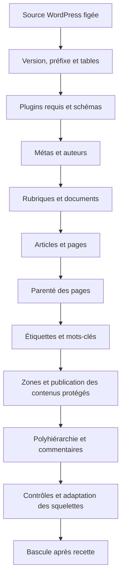

# La chaîne de migration

La commande SPIP-Cli orchestre une suite de traitements dépendants. Elle lit la version WordPress, détermine le préfixe et vérifie la présence des tables avant de commencer à écrire les objets SPIP.

## Ordre disponible

| Rang | Traitement | Pourquoi à cette place ? |
|---|---|---|
| 1 | `importer_metas` | Identité et configuration du site |
| 2 | `importer_auteurs` | Auteurs connus avant d’associer les articles |
| 3 | `importer_rubriques` | Catégories converties avant le classement des articles |
| 4 | `importer_documents` | Médias disponibles pour convertir leurs références |
| 5 | `importer_articles` | Objets centraux, textes, auteur et documents associés |
| 6 | `importer_hierarchie_pages` | Les pages parentes et enfants existent désormais |
| 7 | `importer_mots` | Étiquettes et liens aux articles/pages déjà créés |
| 8 | `importer_acces` | Association aux zones avant publication des contenus protégés |
| 9 | `importer_polyhierarchie` | Relations secondaires entre articles et rubriques existants |
| 10 | `importer_commentaires` | Messages rattachés aux articles et auteurs connus |

Les noms donnés à `--traitements` sélectionnent des étapes sans changer cet ordre. L’outil ne crée pas à la demande les prérequis d’un traitement isolé ; les objets nécessaires doivent déjà exister.

Les [extensions publiées](extensions.md) complètent la liste : `wp2spip_yoast` insère `importer_yoast_categories` juste après les articles et ajoute `importer_yoast_seo` en fin de liste ; `wp2spip_acf` ajoute `importer_acf` en fin de liste. Quand plusieurs extensions sont actives, consulter `--info` pour l’ordre effectif de leurs ajouts.

## Plugins avant les contenus

La détection examine le contenu et ajoute Albums, Accès restreint, Forum ou a2a si nécessaire. Les plugins sont téléchargés, activés et leurs schémas préparés avant les traitements. La commande peut se relancer pour travailler dans le nouvel environnement de plugins.

Si un plugin déjà présent reste inactif faute de dépendances, le moteur utilise SVP pour les préparer et retente l’activation. Il vérifie les plugins requis et refuse aussi de poursuivre si cette activation a désactivé un plugin auparavant actif. Après relance, les tables et champs déclarés doivent exister ; un échec empêche le lancement des traitements.

Une extension peut compléter cette détection par `wp2spip_plugins_requis`. Activer un plugin ne signifie pas que ses données WordPress sont importées : il faut un traitement correspondant.

## Variantes de version

La commande tente une fonction spécialisée pour la version majeure/mineure, puis majeure, puis générique : `wp2spip_<traitement>_<X>_<Y>`, `wp2spip_<traitement>_<X>`, `wp2spip_<traitement>`. Cette architecture permet d’ajouter des adaptations ; elle ne garantit pas que chaque version dispose d’une variante testée.

## Arrêt et réexécution

Un traitement retournant `false` arrête la commande avec code 1. Les étapes précédentes peuvent déjà avoir écrit des objets ; l’import n’est pas une transaction globale avec retour automatique à l’état initial.

Les métas sont réécrites, la polyhiérarchie est réalignée et les fils de commentaires sont recalculés à la relance. Les contenus déjà tracés ne sont généralement pas modifiés. Après interruption ou évolution de l’outil, refaire la migration depuis une destination vierge.

Sources : [orchestration](https://github.com/epilibre-design/wordpress-to-spip-migrator/blob/dc1963eb54b317e7e9e7b445bfee81199a7804bb/spip-cli/WordpressImporter.php), [plugins requis](https://github.com/epilibre-design/wordpress-to-spip-migrator/blob/dc1963eb54b317e7e9e7b445bfee81199a7804bb/inc/wp2spip_plugins.php), [spec d’ensemble](https://github.com/epilibre-design/wordpress-to-spip-migrator/blob/dc1963eb54b317e7e9e7b445bfee81199a7804bb/docs/superpowers/specs/2026-10-08-wp2spip-ensemble-design.md).
