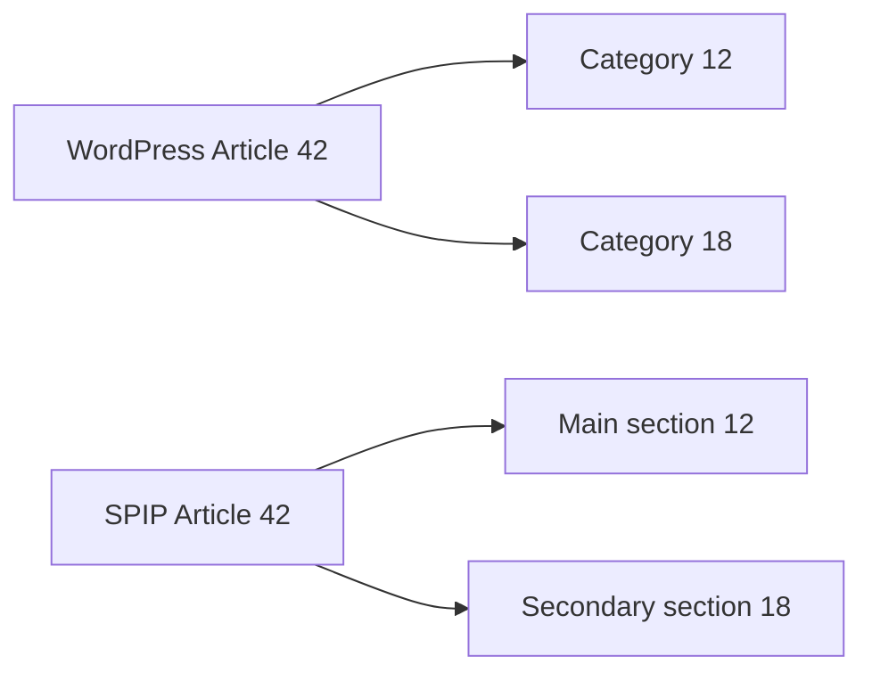

# Categories and tags

A taxonomy links **terms** to content. Its name (`category`, `post_tag`, etc.) is distinct from the term identifier and the taxonomic relationship identifier.

## Categories

| WordPress structure | Role | SPIP |
|---|---|---|
| `terms.term_id`, `name`, `slug` | Identity and label | SPIP section with preserved WordPress identifier |
| `term_taxonomy.taxonomy` | Term family | `category` and `link_category` selection for sections |
| `term_taxonomy.parent` | Hierarchy | Parent section |
| `term_taxonomy.description` | Description | Section text converted by the wp2spip HTML5 converter |
| `term_relationships` | Content–taxonomy link | Main section and secondary sections |

Categories are created before articles, and parents before their children. Titles are decoded from their HTML entities.

## Multiple categories for an article

The main section corresponds to the first category available according to the WordPress relationship order, then the identifier. Other categories become secondary sections using Polyhiérarchie. This process recalculates its associations upon a re-run.

With [wp2spip_yoast](../comprendre/extensions.md#yoast-seo) enabled, the main category chosen in Yoast can override this choice before the secondary sections are calculated. The core alone maintains the rule above.

## Tags

The `importer_mots` process follows articles and page hierarchy. It creates a "Tags" group, then one keyword per `post_tag` term.

| WordPress data | SPIP |
|---|---|
| `terms.term_id` | `id_mot` and `id_wordpress`, identifier preserved |
| `terms.name` | Title, HTML entities decoded |
| Taxonomy description | Description converted by wp2spip |
| `post_tag` relationships | Links to imported articles and pages, regardless of their status |

Tags without content are also included. The engine reads the actual relationships without filtering on `term_taxonomy.count`, which may ignore private content. It enables keywords on articles (`articles_mots = oui`). Upon re-run, it keeps the already tracked keywords and adds missing links.

An identifier collision, a word from a tag moved out of the group, a tracked group deleted, or tagged content absent from SPIP will cause the process to fail. Some words or links may have already been created: reset the destination to perform a full import.

## Other taxonomies and metadata

Post formats, custom taxonomies, and term metadata (`termmeta`) are not generally converted by wp2spip. Their presence in the database does not imply that they are used by the engine.

## Verifying categories and tags after migration

Compare section parents and the set of categories for several articles. Check categories without a main article, tags without content, links on pages, and private content. Custom taxonomies remain to be adapted.

Sources: [sections](https://github.com/epilibre-design/wordpress-to-spip-migrator/blob/dc1963eb54b317e7e9e7b445bfee81199a7804bb/wp2spip/importer_rubriques.php), [polyhierarchy](https://github.com/epilibre-design/wordpress-to-spip-migrator/blob/dc1963eb54b317e7e9e7b445bfee81199a7804bb/wp2spip/importer_polyhierarchie.php), [tags](https://github.com/epilibre-design/wordpress-to-spip-migrator/blob/dc1963eb54b317e7e9e7b445bfee81199a7804bb/wp2spip/importer_mots.php), [keyword tests](https://github.com/epilibre-design/wordpress-to-spip-migrator/blob/dc1963eb54b317e7e9e7b445bfee81199a7804bb/tests/integration/MotsTest.php), [WordPress model](../wordpress/modele.md).
