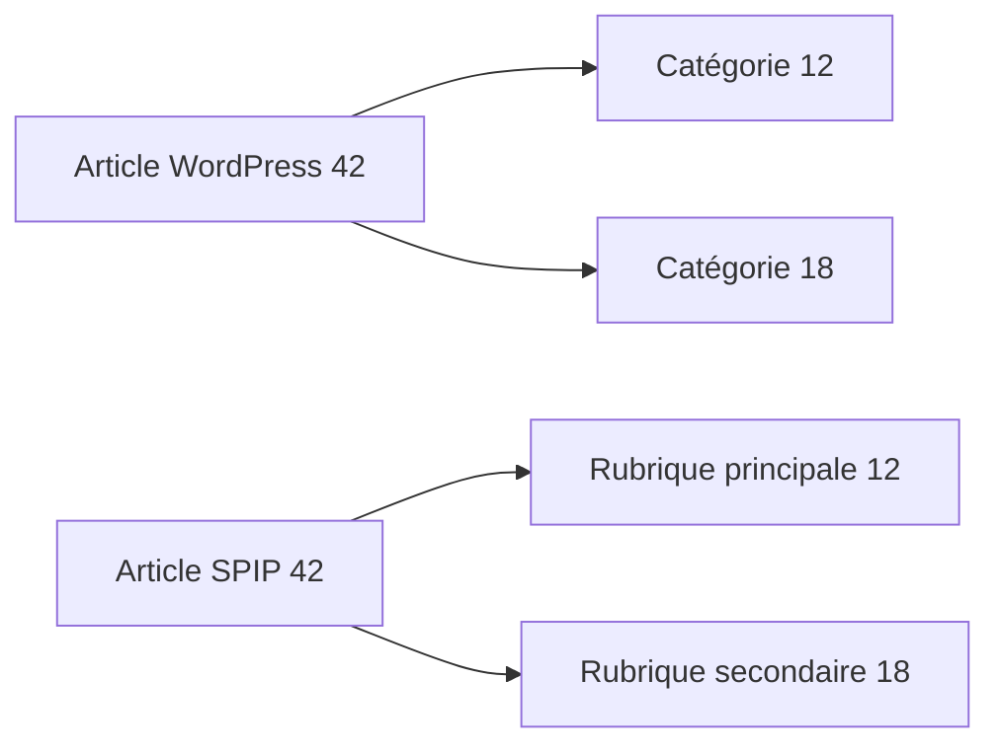

# Catégories et étiquettes

Une taxonomie relie des **termes** à des contenus. Son nom (`category`, `post_tag`…) est distinct de l’identifiant du terme et de celui de la relation taxonomique.

## Catégories : implémenté

| Structure WordPress | Rôle | SPIP |
|---|---|---|
| `terms.term_id`, `name`, `slug` | Identité et libellé | Rubrique avec identifiant WordPress conservé |
| `term_taxonomy.taxonomy` | Famille de termes | Sélection `category` et `link_category` pour les rubriques |
| `term_taxonomy.parent` | Hiérarchie | Rubrique parente |
| `term_taxonomy.description` | Description | Texte de rubrique converti par le convertisseur HTML5 de wp2spip |
| `term_relationships` | Lien contenu–taxonomie | Rubrique principale et rubriques secondaires |

Les catégories sont créées avant les articles et les parents avant leurs enfants. Les titres sont décodés de leurs entités HTML.

## Plusieurs catégories pour un article

La rubrique principale correspond à la première catégorie disponible selon l’ordre des relations WordPress, puis l’identifiant. Les autres catégories deviennent des rubriques secondaires avec Polyhiérarchie. Ce traitement recalcule ses associations lors d’une relance.

Avec [wp2spip_yoast](../comprendre/extensions.md#yoast-seo) active, la catégorie principale choisie dans Yoast peut remplacer ce choix avant le calcul des rubriques secondaires. Le cœur seul conserve la règle ci-dessus.

## Étiquettes : implémenté

Le traitement `importer_mots` suit les articles et la hiérarchie des pages. Il crée un groupe « Étiquettes », puis un mot-clé par terme `post_tag`.

| Donnée WordPress | SPIP |
|---|---|
| `terms.term_id` | `id_mot` et `id_wordpress`, identifiant conservé |
| `terms.name` | Titre, entités HTML décodées |
| Description de la taxonomie | Descriptif converti par wp2spip |
| Relations `post_tag` | Liens aux articles et pages importés, quel que soit leur statut |

Les étiquettes sans contenu sont également reprises. Le moteur lit les relations réelles, sans filtrer sur `term_taxonomy.count`, qui peut ignorer les contenus privés. Il active les mots-clés sur les articles (`articles_mots = oui`). À la relance, il garde les mots déjà tracés et ajoute les liens manquants.

Une collision d’identifiant, un mot issu d’une étiquette déplacé hors du groupe, un groupe tracé supprimé ou un contenu étiqueté absent de SPIP fait échouer le traitement. Certains mots ou liens peuvent déjà avoir été créés : remettre la destination à zéro pour refaire l’import complet.

## Autres taxonomies et métadonnées

Formats d’article, taxonomies personnalisées et métadonnées de termes (`termmeta`) ne sont pas convertis de façon générale par cette révision. Leur présence dans la base n’implique pas qu’elles soient utilisées par le moteur.

## Contrôler

Comparer les parents de rubriques et l’ensemble des catégories de plusieurs articles. Vérifier les catégories sans article principal, les étiquettes sans contenu, les liens sur les pages et les contenus privés. Les taxonomies personnalisées restent à adapter.

Sources : [rubriques](https://github.com/epilibre-design/wordpress-to-spip-migrator/blob/dc1963eb54b317e7e9e7b445bfee81199a7804bb/wp2spip/importer_rubriques.php), [polyhiérarchie](https://github.com/epilibre-design/wordpress-to-spip-migrator/blob/dc1963eb54b317e7e9e7b445bfee81199a7804bb/wp2spip/importer_polyhierarchie.php), [étiquettes](https://github.com/epilibre-design/wordpress-to-spip-migrator/blob/dc1963eb54b317e7e9e7b445bfee81199a7804bb/wp2spip/importer_mots.php), [tests des mots-clés](https://github.com/epilibre-design/wordpress-to-spip-migrator/blob/dc1963eb54b317e7e9e7b445bfee81199a7804bb/tests/integration/MotsTest.php), [modèle WordPress](../wordpress/modele.md).
