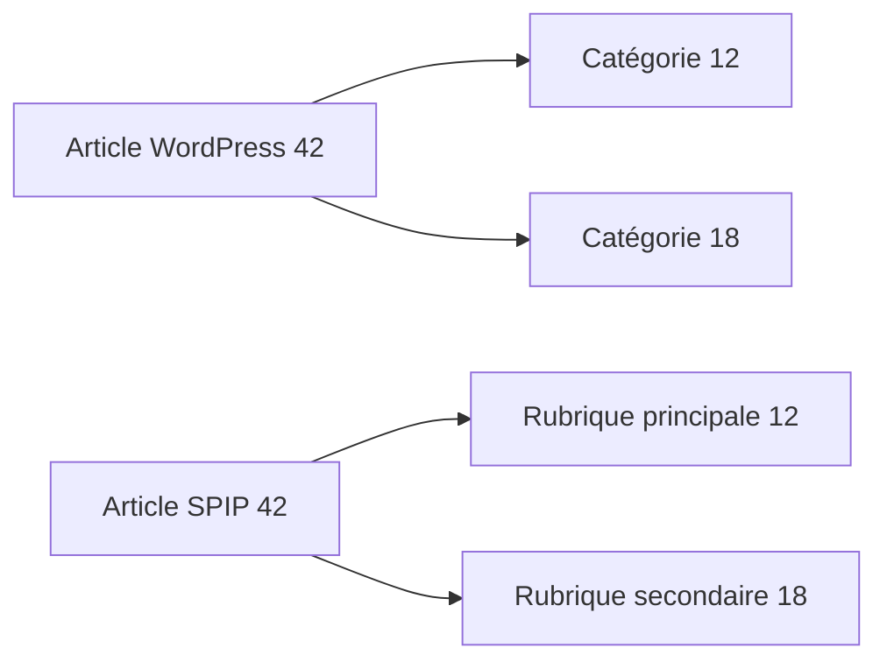

# Catégories et étiquettes

Une taxonomie relie des **termes** à des contenus. Son nom (`category`, `post_tag`…) est distinct de l’identifiant du terme et de celui de la relation taxonomique.

## Catégories : implémenté

| Structure WordPress | Rôle | SPIP |
|---|---|---|
| `terms.term_id`, `name`, `slug` | Identité et libellé | Rubrique avec identifiant WordPress conservé |
| `term_taxonomy.taxonomy` | Famille de termes | Sélection `category` et `link_category` pour les rubriques |
| `term_taxonomy.parent` | Hiérarchie | Rubrique parente |
| `term_taxonomy.description` | Description | Texte de rubrique converti par Sale |
| `term_relationships` | Lien contenu–taxonomie | Rubrique principale et rubriques secondaires |

Les catégories sont créées avant les articles et les parents avant leurs enfants. Les titres sont décodés de leurs entités HTML.

## Plusieurs catégories pour un article

La rubrique principale correspond à la première catégorie disponible selon l’ordre des relations WordPress, puis l’identifiant. Les autres catégories deviennent des rubriques secondaires avec Polyhiérarchie. Ce traitement recalcule ses associations lors d’une relance.

Une catégorie principale choisie par Yoast n’est pas appliquée par le cœur documenté : [une extension est prévue](../comprendre/extensions.md).

## Étiquettes : prévues par une spec

**Non implémenté dans la révision documentée ; prévu par la spec.** Le traitement `importer_mots` n’y existe pas.

La cible décrite est un mot-clé SPIP par terme `post_tag`, dans un groupe « Étiquettes », avec conservation de `term_id`, description et liens aux articles. Les étiquettes sans contenu doivent également être reprises ; `term_taxonomy.count` ne suffit pas à reconstituer leurs relations, notamment pour les contenus privés.

Ce tableau explique une décision de conception, pas une commande disponible. Lire [la spec étiquettes](https://github.com/tech-nova/wordpress-to-spip-migrator/blob/9f08d61f86515d80975cb6fbb228cac0142437f2/docs/superpowers/specs/2026-10-09-wp2spip-etiquettes-design.md).

## Autres taxonomies et métadonnées

Formats d’article, taxonomies personnalisées et métadonnées de termes (`termmeta`) ne sont pas convertis de façon générale par cette révision. Leur présence dans la base n’implique pas qu’elles soient utilisées par le moteur.

## Contrôler

Comparer les parents de rubriques et l’ensemble des catégories de plusieurs articles. Vérifier les catégories sans article principal et les contenus privés. Préparer une solution explicite pour les étiquettes et les taxonomies non reprises.

Sources : [rubriques](https://github.com/tech-nova/wordpress-to-spip-migrator/blob/9f08d61f86515d80975cb6fbb228cac0142437f2/wp2spip/importer_rubriques.php), [polyhiérarchie](https://github.com/tech-nova/wordpress-to-spip-migrator/blob/9f08d61f86515d80975cb6fbb228cac0142437f2/wp2spip/importer_polyhierarchie.php), [modèle WordPress](../wordpress/modele.md).
