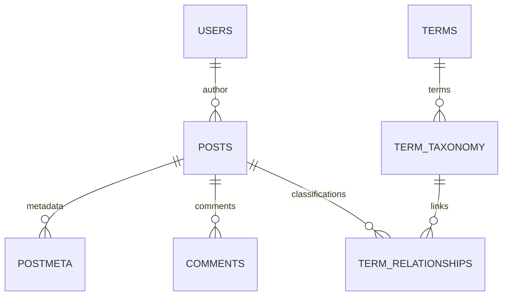

# Understanding the WordPress data model

A table name is not enough to identify a feature. WordPress uses a stable relational foundation, extensible metadata, and multiple content representations within the same columns.

## Three layers

| Layer | Example | Migration question |
|---|---|---|
| SQL Schema | `posts`, `postmeta`, `term_relationships` | Which columns and relations must be read? |
| Types and metadata | `post`, `page`, `wp_block`, meta key | What does this record mean? |
| Content representation | HTML, shortcode, block tree, reference | Should it be converted, resolved, or rebuilt? |

The block editor does not create a SQL table per block. A site template may use the `posts` table but not be an importable editorial article.

## Table families

| Tables, without prefix | Data and relations |
|---|---|
| `posts`, `postmeta` | Articles, pages, media, revisions, and other types; key/value metadata |
| `terms`, `term_taxonomy`, `term_relationships` | Terms, taxonomy membership, and object associations |
| `termmeta` | Term metadata, introduced in WP4.4 |
| `users`, `usermeta` | Identities, profiles, and capabilities |
| `comments`, `commentmeta` | Messages, parentage, moderation status, and metadata |
| `options` | Configuration, simple or serialized values |

`wp_` is a default prefix, not a fixed part of the model. The engine uses the prefix actually selected. Not all of these tables are read by wp2spip: `termmeta` and `commentmeta`, for example, are not imported in a general way.

## Links are the data

This diagram represents the logical relations used by applications, not foreign key constraints guaranteed by the database. `post_parent` is used for different parentage depending on the type: child page, attached media, or revision.

## From the WordPress model to SPIP objects

SPIP uses tables and associations dedicated to articles, SPIP sections, authors, documents, and forums. The migrator translates the chosen relations using SPIP APIs and appropriate plugins. Additional metadata does not automatically have a corresponding column.

[Mappings](../correspondances/index.md) · [WP4](wp4.md) · [WP5](wp5.md) · [WP6](wp6.md) · [WP7](wp7.md).

Sources: [official 4.4 schema](https://github.com/WordPress/WordPress/blob/f6a29831c76d2dbe82e9ae673539f910654c58a4/wp-admin/includes/schema.php), [official 7.1 schema](https://github.com/WordPress/WordPress/blob/b998fef9238af183f9523b3df71618e6e57498b6/wp-admin/includes/schema.php), [tables consulted by the engine](https://github.com/epilibre-design/wordpress-to-spip-migrator/blob/dc1963eb54b317e7e9e7b445bfee81199a7804bb/inc/wp2spip.php).
