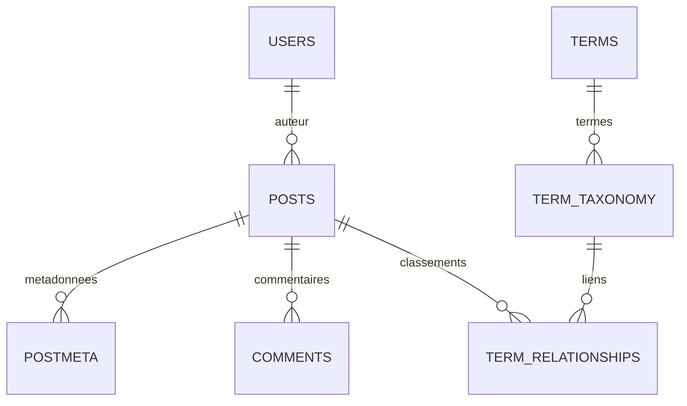

# Comprendre le modèle de données WordPress

Le nom d’une table ne suffit pas à identifier une fonctionnalité. WordPress utilise un socle relationnel stable, des métadonnées extensibles et plusieurs représentations de contenu dans les mêmes colonnes.

## Trois couches

| Couche | Exemple | Question pour la migration |
|---|---|---|
| Schéma SQL | `posts`, `postmeta`, `term_relationships` | Quelles colonnes et relations faut-il lire ? |
| Types et métadonnées | `post`, `page`, `wp_block`, clé de méta | Que signifie cet enregistrement ? |
| Représentation du contenu | HTML, shortcode, arbre de blocs, référence | Faut-il convertir, résoudre ou reconstruire ? |

L’éditeur de blocs ne crée pas une table SQL par bloc. Un modèle du site peut utiliser la table `posts` mais ne pas être un article éditorial importable.

## Les familles de tables

| Tables, sans préfixe | Données et relations |
|---|---|
| `posts`, `postmeta` | Articles, pages, médias, révisions et autres types ; métadonnées clé/valeur |
| `terms`, `term_taxonomy`, `term_relationships` | Termes, appartenance à une taxonomie et associations aux objets |
| `termmeta` | Métadonnées des termes, introduites en WP4.4 |
| `users`, `usermeta` | Identités, profils et capacités |
| `comments`, `commentmeta` | Messages, parenté, état de modération et métadonnées |
| `options` | Configuration, valeurs simples ou sérialisées |

`wp_` est un préfixe par défaut, pas une partie fixe du modèle. Le moteur utilise le préfixe effectivement sélectionné. Toutes ces tables ne sont pas lues par la révision documentée : `termmeta` et `commentmeta`, par exemple, ne sont pas importées de façon générale.

## Les liens sont les données

Ce diagramme représente les relations logiques utilisées par les applications, pas des contraintes de clés étrangères garanties par la base. `post_parent` sert à différentes parentés selon le type : page enfant, média rattaché ou révision.

## Du modèle WordPress aux objets SPIP

SPIP utilise des tables et des associations dédiées aux articles, rubriques, auteurs, documents et forums. Le migrateur traduit les relations choisies avec les API SPIP et les plugins adaptés. Les métadonnées supplémentaires n’ont pas automatiquement une colonne correspondante.

[Correspondances](../correspondances/index.md) · [WP4](wp4.md) · [WP5](wp5.md) · [WP6](wp6.md) · [WP7](wp7.md).

Sources : [schéma officiel 4.4](https://github.com/WordPress/WordPress/blob/f6a29831c76d2dbe82e9ae673539f910654c58a4/wp-admin/includes/schema.php), [schéma officiel 7.1](https://github.com/WordPress/WordPress/blob/b998fef9238af183f9523b3df71618e6e57498b6/wp-admin/includes/schema.php), [tables consultées par le moteur](https://github.com/epilibre-design/wordpress-to-spip-migrator/blob/dc1963eb54b317e7e9e7b445bfee81199a7804bb/inc/wp2spip.php).
